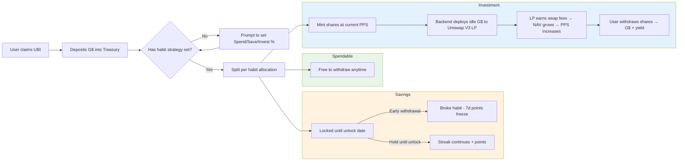
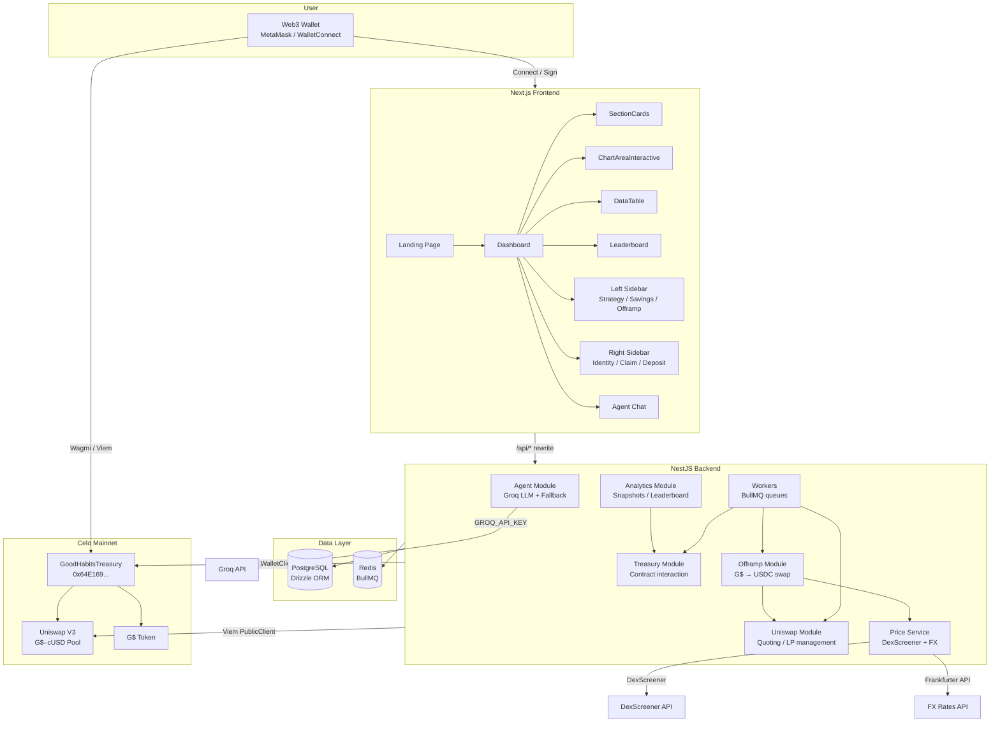
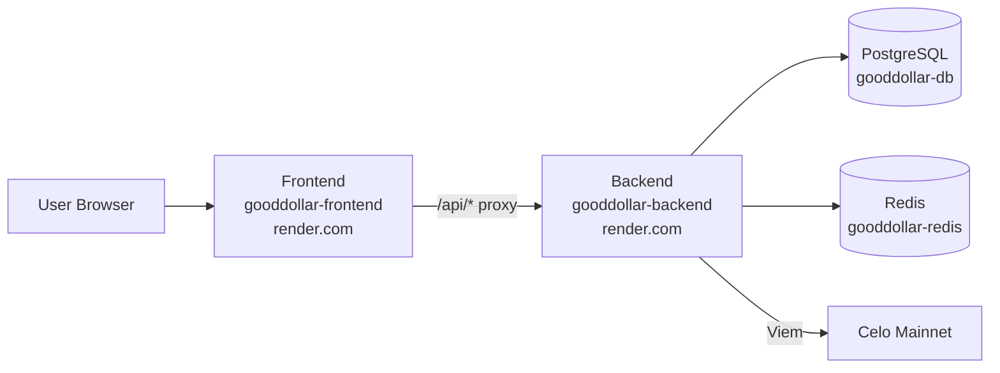

# GoodHabit

**Turn your GoodDollar UBI into lasting wealth.**

GoodHabit is a DeFi savings & investment dApp built on [Celo](https://celo.org) that helps GoodDollar UBI recipients automatically save, invest, and grow their daily Universal Basic Income. Set a habit strategy once, and the protocol handles the rest — splitting each deposit across spendable, savings, and investment buckets, building streaks, deploying capital into Uniswap V3 LP positions, and tracking progress on a gamified leaderboard.

## How It Works



## Repository Structure

```
gooddollar/
├── frontend/        # Next.js 16 dApp (TypeScript, Tailwind, shadcn/ui)
├── backend/         # NestJS 11 API server (PostgreSQL, Redis, BullMQ)
├── contracts/       # Foundry Solidity smart contracts
└── README.md
```

## Tech Stack

| Layer | Technology |
|---|---|
| **Blockchain** | Celo (chain 42220), Solidity 0.8.28, Foundry |
| **Backend** | NestJS 11, TypeScript, PostgreSQL (Drizzle ORM), Redis (BullMQ), Viem |
| **Frontend** | Next.js 16, React 19, Tailwind CSS 4, shadcn/ui, Wagmi, Reown AppKit |
| **AI** | Groq API (llama-3.3-70b-versatile), custom fallback agent |
| **DeFi** | Uniswap V3 (G$–cUSD pool on Celo), DexScreener price feed |
| **Identity** | GoodDollar Citizen SDK (Face Verification, UBI claiming) |

## System Architecture



## Quick Start

### Prerequisites

- Node.js 20+
- PostgreSQL running on `localhost:5432`
- Redis running on `localhost:6379`
- A Celo wallet private key for the backend bot
- A [Groq API key](https://console.groq.com)

### 1. Smart Contracts

```bash
cd contracts
cp .env.example .env      # fill in PRIVATE_KEY_DEPLOYER, RPC URLs, etc.
forge build
forge test
make deploy NETWORK=mainnet
```

### 2. Backend

```bash
cd backend
cp .env.example .env      # fill in RPC_URL, BACKEND_PRIVATE_KEY, DATABASE_URL, etc.
npm install
npm run start:dev
```

### 3. Frontend

```bash
cd frontend
cp .env.example .env      # fill in NEXT_PUBLIC_* vars
npm install
npm run dev
```

Visit `http://localhost:3001` (or whichever port the frontend runs on).

## Environment Overview

| Variable | Where | Purpose |
|---|---|---|
| `RPC_URL` | backend | Celo RPC endpoint (e.g. Forno) |
| `BACKEND_PRIVATE_KEY` | backend | Hot wallet for on-chain operations |
| `DATABASE_URL` | backend | PostgreSQL connection |
| `REDIS_URL` | backend | Redis connection for BullMQ |
| `GROQ_API_KEY` | backend | AI agent LLM inference |
| `NEXT_PUBLIC_API_URL` | frontend | Backend URL for API proxy |
| `PRIVATE_KEY_DEPLOYER` | contracts | Contract deployment key |
| `ETHERSCAN_API_KEY` | contracts | Contract verification |

## Deploy to Render

This repo includes a [`render.yaml`](./render.yaml) for one-click deployment via [Render Blueprint](https://render.com/docs/blueprint-spec).

### One-click deploy

[](https://render.com/deploy?repo=https://github.com/YOUR_USERNAME/gooddollar)

Replace with your repo URL, or:

### Manual CLI setup

```bash
# Install Render CLI
npm install -g @render/cli

# Login and deploy
render blueprint apply --repo https://github.com/YOUR_USERNAME/gooddollar
```

### What gets created

| Resource | Type | Plan |
|---|---|---|
| `gooddollar-db` | PostgreSQL | Free (256 MB) |
| `gooddollar-redis` | Redis | Free (25 MB) |
| `gooddollar-backend` | Web Service (Node) | Free |
| `gooddollar-frontend` | Web Service (Node) | Free |

### Post-deploy

1. Go to **Dashboard → gooddollar-backend → Environment** and add secrets:
   - `BACKEND_PRIVATE_KEY` — the backend hot wallet private key
   - `GROQ_API_KEY` — your Groq API key
2. Push the database schema:
   ```bash
   # In a local terminal with DATABASE_URL pointing to the Render Postgres:
   cd backend && npx drizzle-kit push
   ```
3. Verify health: visit `https://gooddollar-backend.onrender.com/api/dashboard` (expects auth headers, but confirms the service is up).

### Architecture on Render



The frontend rewrites `/api/*` to the backend via `NEXT_PUBLIC_API_URL`. No separate reverse proxy needed.

## Detailed Documentation

- [Backend README](./backend/README.md) — API endpoints, modules, database schema, worker flows
- [Frontend README](./frontend/README.md) — pages, components, hooks, wallet integration
- [Contracts README](./contracts/README.md) — smart contract architecture, deployment, roles
