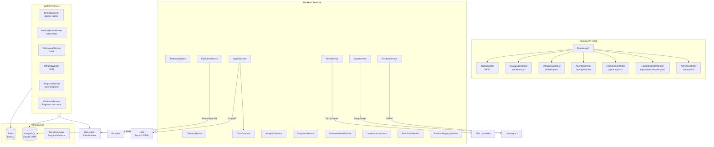
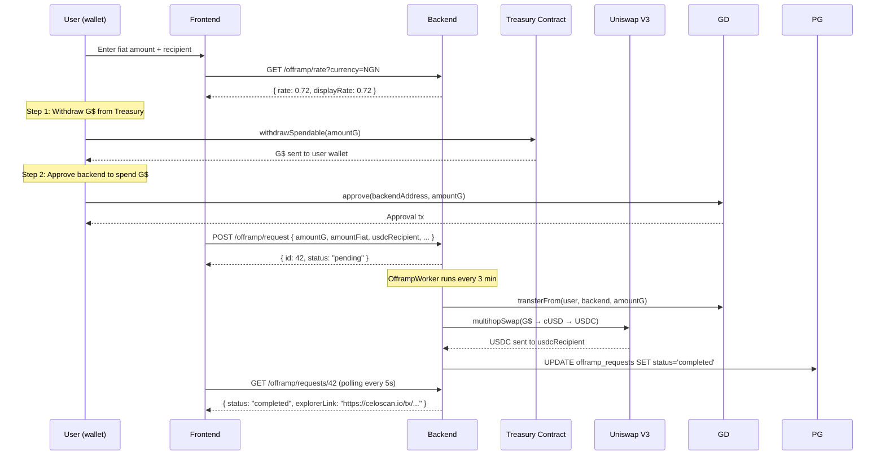
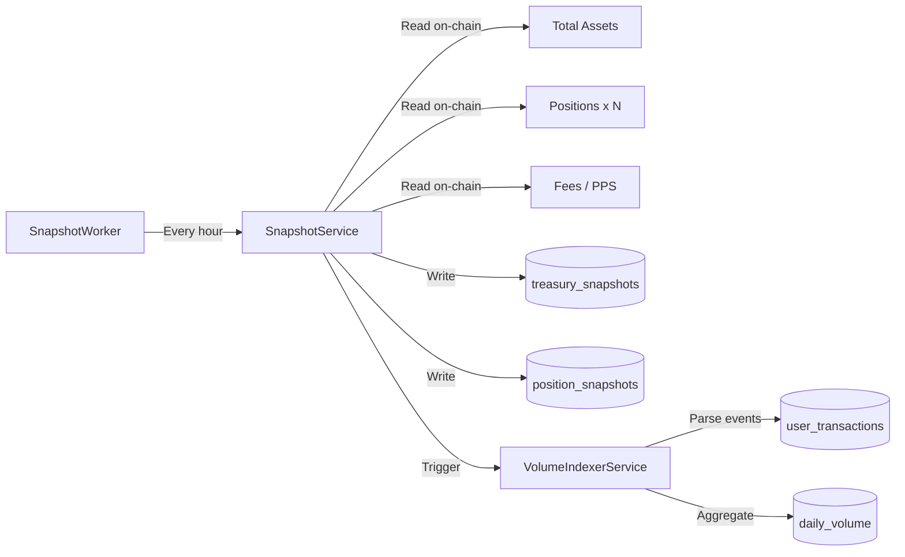

# GoodHabit Backend

NestJS 11 API server that powers the GoodHabit dApp — managing on-chain treasury operations, DeFi strategy automation, AI assistant, fiat offramp, analytics snapshots, and a gamified leaderboard.

## Architecture



## Modules

### Treasury (`/api/treasury`)

Interacts with the on-chain `GoodHabitsTreasury` contract via Viem. All write operations use the backend's `STRATEGY_ROLE` hot wallet.

**Key service methods:**

```typescript
// src/treasury/treasury.service.ts
async calculateTotalAssets(): Promise<bigint> {
  return this.publicClient.readContract({
    address: this.treasuryAddress,
    abi: TREASURY_ABI,
    functionName: 'calculateTotalAssets',
  })
}

async getUserPosition(user: Address): Promise<UserPositionResponse> {
  return this.publicClient.readContract({
    address: this.treasuryAddress,
    abi: TREASURY_ABI,
    functionName: 'getUserPosition',
    args: [user],
  })
}
```

Read endpoints (full list at [API Reference](#api-reference)):

| Endpoint | Description |
|---|---|
| `GET /total-assets` | Total G$ under management |
| `GET /price-per-share` | Current PPS (determines yield) |
| `GET /users/:address` | User position (shares, value, PnL) |
| `GET /active-positions` | Active LP position IDs |
| `GET /accrued-fees` | Total unclaimed protocol fees |

Write endpoints are restricted to the backend wallet role and used by the worker system.

### Agent (`POST /api/agent/chat`)

A dual-mode AI assistant for the GoodHabit platform.

**Mode 1 — LLM (default):** Sends the user's message + conversation history + system prompt to Groq's `llama-3.3-70b-versatile`. Supports tool calling:

```typescript
// src/agent/agent.service.ts — tool definitions
const tools: ChatCompletionTool[] = [
  {
    type: 'function',
    function: {
      name: 'get_user_position',
      description: 'Get a user\'s position in the GoodDollar treasury',
      parameters: {
        type: 'object',
        properties: {
          address: { type: 'string', description: 'Ethereum address' },
        },
        required: ['address'],
      },
    },
  },
  // ... get_treasury_summary, get_leaderboard, get_claim_info, simulate_withdrawal_impact
]
```

The assistant can look up real on-chain data (user position, treasury stats, leaderboard) during the conversation through multi-round tool calling.

**Mode 2 — Fallback:** When the Groq API key is missing or the LLM call fails, a keyword-based pattern matcher responds with templated answers. The fallback covers savings, investment, offramp, PPS/yield, strategy/allocation, compounding, and off-topic queries.

**Guard system:** All messages are first checked against an on-topic keyword list. Completely off-topic messages get a polite redirection:

```typescript
// src/agent/guard.ts
const GUARD_KEYWORDS = [
  'ubi', 'gooddollar', 'treasury', 'save', 'streak', 'leaderboard',
  'position', 'withdraw', 'deposit', 'share', 'price per share',
  'offramp', 'invest', 'goodhabit', 'compound', 'liquidity', 'pool',
  // ...
]
```

### Offramp (`/api/offramp`)

Converts G$ to USDC and sends it to a user-specified Celo address. The pipeline is fully non-custodial:



The offramp swap uses a multi-hop route through the Uniswap V3 G$–cUSD pool (1% fee tier), then through the cUSD–USDC pool:

```typescript
// src/modules/uniswap.config.ts
export const G_DOLLAR = '0x62B8B11039FcfE5aB0C56E502b1C372A3d2a9c7A'
export const CUSD     = '0x765DE816845861e75A25fCA122bb6898B8B1282a'
export const USDC     = '0xcebA9300f2b948710d2653dD7B07f33A8B32118C'
```

### Analytics (`/api/analytics`)

**Snapshot system** captures the treasury state on a cron schedule:



**Leaderboard** computes gamified savings rankings:

```
Points = streakPts + amountPts + consistencyPts

streakPts    = currentStreak × multiplier
               multiplier = 10 (1-7d), 20 (8-30d), 30 (31d+)

amountPts    = min(totalSaved / 1e18, 10000)   ← capped at 10,000

consistencyPts = consistency × 50              ← ratio 0–1
```

Tiers: **Bronze** (0) → **Silver** (500) → **Gold** (2000) → **Platinum** (5000) → **Diamond** (10000).

### Workers (BullMQ)

All background jobs use Redis-backed BullMQ queues with cron scheduling registered on startup in `ProducerService`.

| Queue | Schedule | Worker | What It Does |
|---|---|---|---|
| `strategy` | hourly | StrategyWorker | Deploys idle G$ to Uniswap V3 LP |
| `fee-collection` | daily | FeeCollectionWorker | Computes position value changes, collects protocol fees |
| `withdrawal` | every 5 min | WithdrawalWorker | Fulfills pending withdrawals by closing LP positions if needed |
| `offramp` | every 3 min | OfframpWorker | Processes pending offramp requests |
| `snapshot` | configurable | SnapshotWorker | Records treasury/position snapshots to DB |

### Strategy / LP Management Flow

```mermaid
flowchart TB
    subgraph Hourly[StrategyWorker — every hour]
        I[Read idle G$ = assetsToInvest - reservedAssets]
        I -->|idle >= 10 G$| D[deployToStrategy: send 50% of idle]
        D -->|Swap half G$ → cUSD| S[Uniswap exactInputSingle]
        S -->|Mint or increase LP| M[NFPM mint / increaseLiquidity]
        M -->|Register on-chain + DB| R[registerPosition tokenId]
    end
    
    subgraph Daily[FeeCollectionWorker — every day]
        P[For each active position] --> C[Compute current value<br/>tickToSqrtRatio<br/>getAmount0Delta / getAmount1Delta]
        C --> U[updatePositionValue on-chain]
        U --> F[collectFees on Treasury]
    end
    
    subgraph OnDemand[WithdrawalWorker — every 5 min]
        CH[reserved > idle?] -->|yes| CP[Close positions: collect fees → swap cUSD→G$ → receiveFromStrategy]
    end
```



## Database Schema

The backend uses [Drizzle ORM](https://orm.drizzle.team) with PostgreSQL. Nine tables:

```typescript
// src/drizzle/schema/treasury-snapshots.ts
export const treasurySnapshots = pgTable('treasury_snapshots', {
  id: bigserial('id', { mode: 'bigint' }).primaryKey(),
  timestamp: timestamp('timestamp', { withTimezone: true }).notNull().defaultNow(),
  totalAssets: numeric('total_assets').notNull(),
  idleAssets: numeric('idle_assets').notNull(),
  deployedAssets: numeric('deployed_assets').notNull(),
  reservedAssets: numeric('reserved_assets').notNull(),
  totalShares: numeric('total_shares').notNull(),
  pricePerShare: numeric('price_per_share').notNull(),
  accruedFees: numeric('accrued_fees').notNull(),
  activePositions: integer('active_positions').notNull(),
  blockNumber: numeric('block_number').notNull(),
})
```

| Table | Purpose |
|---|---|
| `treasury_snapshots` | Historical NAV at each snapshot |
| `position_snapshots` | Per-position LP value over time |
| `daily_volume` | Aggregated deposit/withdrawal/claim metrics |
| `user_stats_snapshots` | Historical user base stats |
| `user_habits` | User strategies, streaks, points, freeze status |
| `user_transactions` | Per-user transaction log |
| `indexer_state` | Last indexed block for event parsing |
| `offramp_requests` | Offramp pipeline tracking |
| `position_registry` | Active LP position metadata |

## API Reference

All endpoints are prefixed with `/api`.

### App

| Method | Path | Description |
|---|---|---|
| GET | `/` | Health check |

### Treasury (`/api/treasury`)

| Method | Path | Description |
|---|---|---|
| GET | `/total-assets` | Total G$ under management |
| GET | `/price-per-share` | Share price (yield indicator) |
| GET | `/positions/:tokenId` | LP position data by Uniswap token ID |
| GET | `/users/:address` | User position (shares, value, PnL) |
| GET | `/active-positions` | Array of active LP token IDs |
| GET | `/assets-to-invest` | Idle G$ deployable to strategies |
| GET | `/deployed-assets` | G$ currently in strategies |
| GET | `/reserved-assets` | G$ reserved for withdrawals |
| GET | `/total-shares` | Total shares outstanding |
| GET | `/accrued-fees` | Accrued protocol fees |
| GET | `/fee-bps` | Fee rate in basis points |
| POST | `/deploy-to-strategy` | Deploy idle G$ to strategy |
| POST | `/receive-from-strategy` | Receive G$ back from strategy |
| POST | `/register-position` | Register LP position |
| POST | `/close-position` | Close LP position |
| POST | `/update-position-value` | Sync position valuation |
| POST | `/mark-withdrawal-ready` | Mark withdrawal ready for user |
| POST | `/finalize-withdrawal` | Finalize user withdrawal |
| POST | `/collect-fees` | Harvest protocol fees |

### Analytics (`/api/analytics`)

| Method | Path | Description |
|---|---|---|
| GET | `/nav?range=7d|30d|90d` | NAV history (idle, deployed, reserved) |
| GET | `/price-per-share?range=` | PPS history |
| GET | `/revenue?range=` | Fee accrual history |
| GET | `/volume?range=` | Deposit/withdrawal volume |
| GET | `/snapshots?range=` | Raw daily volume rows |
| GET | `/summary` | Latest snapshot + 24h changes |
| GET | `/summary/live` | Live on-chain data (no snapshot) |
| GET | `/user-alloc?user=` | User's Spend/Save/Invest split |
| GET | `/user-txns?user=` | Last 100 user transactions |
| GET | `/leaderboard` | Top 100 leaderboard |
| GET | `/leaderboard/status?user=` | User's leaderboard status |
| POST | `/snapshot` | Trigger manual snapshot |
| POST | `/refresh?user=` | Refresh user analytics data |
| POST | `/habits` | Save user habit strategy |

### Offramp (`/api/offramp`)

| Method | Path | Description |
|---|---|---|
| GET | `/rate?currency=USD` | Live G$ → fiat rate |
| GET | `/beneficiary` | Backend hot wallet address |
| POST | `/request` | Submit offramp request |
| GET | `/requests?address=` | List requests (filtered by user) |
| GET | `/requests/:id` | Single request status |

### Agent (`/api/agent`)

| Method | Path | Description |
|---|---|---|
| POST | `/chat` | Chat with AI assistant |

### Admin (`/api/admin`)

| Method | Path | Description |
|---|---|---|
| POST | `/strategy/trigger` | Manually enqueue deploy-and-lp |

## Example API Calls

```bash
# Get treasury summary
curl http://localhost:3000/api/analytics/summary

# Get user position
curl http://localhost:3000/api/treasury/users/0x2c060c1ba11e508197d7ae5ef5dc86779025ec8d

# Get leaderboard top 10
curl "http://localhost:3000/api/analytics/leaderboard?limit=10"

# Chat with AI agent
curl -X POST http://localhost:3000/api/agent/chat \
  -H 'Content-Type: application/json' \
  -d '{"address":"0x...","message":"What is my current position?","history":[]}'

# Get offramp rate for Nigerian Naira
curl "http://localhost:3000/api/offramp/rate?currency=NGN"

# Submit offramp request
curl -X POST http://localhost:3000/api/offramp/request \
  -H 'Content-Type: application/json' \
  -d '{
    "userAddress": "0x...",
    "amountG": "10000000000000000000",
    "amountFiat": "7.2",
    "rateUsed": "0.72",
    "targetCurrency": "USD",
    "usdcRecipient": "0x..."
  }'
```

## Environment Variables

| Variable | Required | Default | Description |
|---|---|---|---|
| `RPC_URL` | yes | — | Celo RPC endpoint (e.g. `https://forno.celo.org`) |
| `BACKEND_PRIVATE_KEY` | yes | — | Private key for the STRATEGY_ROLE hot wallet |
| `TREASURY_CONTRACT` | yes | — | Deployed GoodHabitsTreasury address |
| `DATABASE_URL` | yes | — | PostgreSQL connection string |
| `REDIS_URL` | yes | — | Redis connection string (BullMQ) |
| `GROQ_API_KEY` | no | — | Groq API key for LLM agent mode |
| `PORT` | no | `3000` | NestJS listen port |
| `SNAPSHOT_CRON` | no | `0 * * * *` | Snapshot schedule (cron) |

## Setup

```bash
# Install dependencies
npm install

# Copy and fill environment
cp .env.example .env

# Push database schema
npx drizzle-kit push

# Development (watch mode)
npm run start:dev

# Production build
npm run build
npm run start:prod
```
