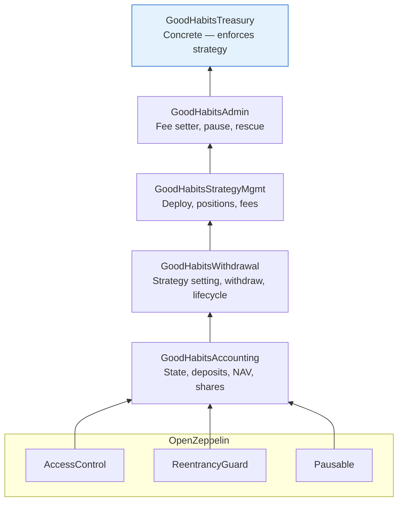
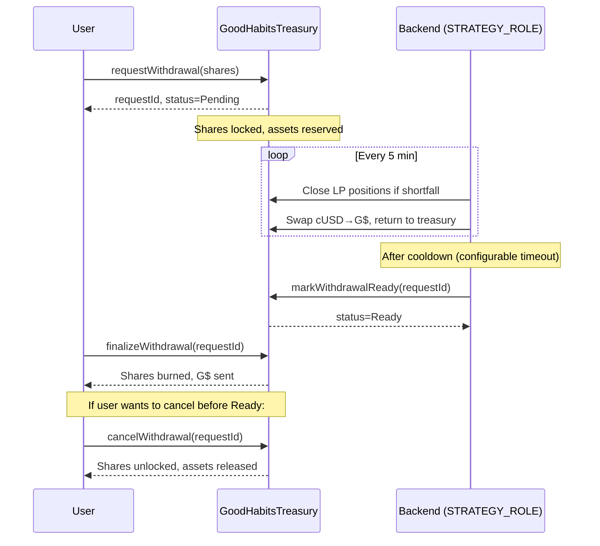

# GoodHabit Smart Contracts

A Foundry-based Solidity project for the `GoodHabitsTreasury` — a share-based vault on Celo that manages G$ deposits with habit-based savings, automated strategy deployment, and a complete withdrawal lifecycle.

**Deployed on Celo Mainnet:** `0x64E169FB7e544D10e3aF116AB25738A02C402903`

## Contract Architecture

The treasury uses a **segmented inheritance** pattern: 5 contracts in a chain, each responsible for a distinct domain of logic.



### Why segmented inheritance?

Each abstract contract layer handles one concern, keeping the codebase modular and auditable:

| Contract | Responsibility |
|---|---|
| `GoodHabitsAccounting` | Share-based vault math, NAV calculation, deposit logic, price per share, inflation attack mitigation |
| `GoodHabitsWithdrawal` | Habit strategy setting, spendable/savings withdrawals, request→finalize lifecycle |
| `GoodHabitsStrategyMgmt` | Strategy deployment, LP position registry, fee collection |
| `GoodHabitsAdmin` | Admin parameters (fee, timeout), pause/unpause, token rescue |
| `GoodHabitsTreasury` | Concrete contract — overrides `_requireStrategySet()` hook |

## Core Concepts

### Shares & Price Per Share (PPS)

```solidity
// GoodHabitsAccounting uses a virtual-offset ERC-4626-inspired model
uint256 public constant VIRTUAL_SHARES = 1_000;
uint256 public constant VIRTUAL_ASSETS = 1_000;

function pricePerShare() public view returns (uint256) {
    return FixedPointMathLib.divWadDown(
        totalAssets() + VIRTUAL_ASSETS,
        totalShares + VIRTUAL_SHARES
    );
}
```

- Users deposit G$ → receive shares for the "invest" portion
- PPS increases as deployed capital generates yield (LP fees, NAV growth)
- Protocol fees are harvested on NAV increases

### Habit Buckets

Each user's deposit is split into three buckets according to their habit strategy:

```solidity
struct Habit {
    uint16 toSpend;     // e.g. 3000 = 30%
    uint16 toSave;      // e.g. 3000 = 30%
    uint16 toInvest;    // e.g. 4000 = 40%
}

struct UserAllocation {
    uint256 spendAmount;    // G$ available for instant withdrawal
    uint256 saveAmount;     // G$ locked until unlock timestamp
    uint256 investAmount;   // G$ converted to shares at deposit
}
```

The three-bucket split must sum to exactly 10000 basis points (100%):

```solidity
function setHabitStrategy(uint256 _toSpend, uint256 _toSave, uint256 _toInvest) external {
    if (_toSpend + _toSave + _toInvest != 10000) revert InvalidAllocation();
    // ...
}
```

### Inflation Attack Mitigation

Like ERC-4626, the contract uses virtual shares and assets (`VIRTUAL_SHARES = 1000`, `VIRTUAL_ASSETS = 1000`) to prevent first-deposit manipulation attacks on the share price.

## Key Functions by Layer

### GoodHabitsAccounting (base layer)

```solidity
// Deposit G$ — splits per habit, mints shares for invest portion
function deposit(uint256 assets) external;

// Total G$ under management (idle + deployed + positions)
function calculateTotalAssets() public view virtual returns (uint256);

// Available liquidity for withdrawal (idle - reserved)
function availableLiquidity() public view returns (uint256);

// Comprehensive user position summary
function getUserPosition(address user) external view returns (UserPosition memory);
```

### GoodHabitsWithdrawal

```solidity
// Set or update habit strategy (must sum to 10000 bps)
function setHabitStrategy(uint256 toSpend, uint256 toSave, uint256 toInvest) external;

// Instant withdrawal from spendable bucket
function withdrawSpendable(uint256 amount) external;

// Withdraw from savings (records broke habit if before unlock)
function withdrawSavings(uint256 amount) external;

// Lock savings until timestamp (sets streak)
function setTargetSavingsUnlock(uint256 timestamp) external;

// Create a withdrawal request — locks shares, reserves assets
function requestWithdrawal(uint256 shares) external;

// (STRATEGY_ROLE) Mark a request as ready for finalization
function markWithdrawalReady(uint256 requestId) external;

// Burn shares, claim G$ (after request is marked ready)
function finalizeWithdrawal(uint256 requestId) external;

// Cancel a withdrawal request
function cancelWithdrawal(uint256 requestId) external;
```

### GoodHabitsStrategyMgmt

```solidity
// Send idle G$ to a whitelisted strategy contract
function deployToStrategy(address strategy, uint256 amount) external;

// Receive G$ back from a strategy
function receiveFromStrategy(uint256 amount) external;

// Register an LP position by Uniswap token ID
function registerPosition(uint256 tokenId, uint256 initialValue) external;

// Close a position, return assets to idle
function closePosition(uint256 tokenId) external;

// Update a position's G$ valuation (called by FeeCollectionWorker)
function updatePositionValue(uint256 tokenId, uint256 newValue) external;

// Collect protocol fees on NAV growth since last snapshot
function collectFees() external;

// Whitelist a strategy address
function approveStrategy(address strategy) external;
```

### GoodHabitsAdmin

```solidity
// Update protocol fee (max 2000 bps = 20%)
function setFeeBps(uint256 _feeBps) external;

// Update withdrawal request timeout
function setRequestTimeout(uint256 _requestTimeout) external;

// Emergency pause
function pause() external;
function unpause() external;

// Rescue accidentally sent non-G$ tokens
function rescueToken(address token, address to, uint256 amount) external;
```

## Structs & Enums

```solidity
enum WithdrawalStatus { Pending, Ready, Processed, Cancelled }
enum WithdrawFrom { Spendable, Savings, Investment }

struct WithdrawalRequest {
    uint256 id;
    uint256 sharesLocked;
    uint256 assetsQuoted;
    address user;
    uint256 createdAt;
    WithdrawalStatus status;
}

struct Position {
    uint256 tokenId;
    uint256 value;
    uint256 createdAt;
    bool active;
}

struct Habit {
    uint16 toSpend;    // basis points
    uint16 toSave;     // basis points
    uint16 toInvest;   // basis points
}

struct UserAllocation {
    uint256 spendAmount;
    uint256 saveAmount;
    uint256 investAmount;
}

struct UserPosition {
    uint256 unlockedShares;
    uint256 lockedShares;
    uint256 ownershipBps;
    uint256 unlockedValue;
    uint256 totalValue;
    uint256 deposited;
    uint256 withdrawn;
    uint256 pnl;
}
```

## Withdrawal Lifecycle



## Role System

The contract uses OpenZeppelin's `AccessControl` with three roles:

| Role | Identifier | Who Holds It | Permissions |
|---|---|---|---|
| `DEFAULT_ADMIN_ROLE` | `0x00` | Deployer address | Set fee, approve strategies, pause, rescue tokens, manage roles |
| `STRATEGY_ROLE` | `keccak256("STRATEGY_ROLE")` | Backend hot wallet | Deploy/receive from strategies, register/close positions, mark withdrawals, collect fees |
| `SYNC_ROLE` | `keccak256("SYNC_ROLE")` | Backend hot wallet | Update position valuations (`updatePositionValue`) |

## Deployment

The project uses Foundry scripts with a Makefile for deployment orchestration.

### Prerequisites

- [Foundry](https://book.getfoundry.sh/getting-started/installation)
- An `.env` file with:

```bash
PRIVATE_KEY_DEPLOYER=0x...
GDOLLAR_ADDRESS=0x62B8B11039FcfE5aB0C56E502b1C372A3d2a9c7A
FEE_BPS=500              # 5%
REQUEST_TIMEOUT=604800    # 7 days
CELO_MAINNET_RPC_URL=https://forno.celo.org
ETHERSCAN_API_KEY=...
BACKEND_ADDRESS=0xb5f3feFeDB2a7c10BECd417215E5183f3E774E82
```

### Deploy

```bash
# Build
forge build

# Test
forge test -vvv

# Deploy to Celo mainnet
make deploy NETWORK=mainnet

# Deploy to Celo Alfajores testnet
make deploy NETWORK=sepolia    # NOTE: "sepolia" in Makefile = Celo Alfajores

# Simulate deployment (no on-chain broadcast)
make deploy NETWORK=mainnet DRY_RUN=true
```

### Post-Deployment

After the treasury contract is deployed, two additional steps are required:

```bash
# 1. Grant STRATEGY_ROLE and SYNC_ROLE to the backend wallet
make grant-roles NETWORK=mainnet

# 2. Whitelist the backend address as a strategy
make approve-strategy NETWORK=mainnet
```

### Deployment Scripts

```solidity
// script/DeployTreasury.s.sol
function run() external {
    vm.startBroadcast(deployerPrivateKey);
    GoodHabitsTreasury treasury = new GoodHabitsTreasury(
        GDOLLAR_ADDRESS,
        FEE_BPS,          // e.g. 500 = 5%
        REQUEST_TIMEOUT   // e.g. 604800 = 7 days
    );
    vm.stopBroadcast();
}
```

## Testing

The test suite in `test/GoodHabitsTreasury.t.sol` contains 100+ test cases covering:

- **Deposit** — correct allocation split, share minting, event emission
- **Withdrawal** — spendable/savings/investment flows, streak tracking, broke habits
- **Strategy** — deploy, receive, position registration, fee collection
- **Admin** — fee changes, pausing, token rescue, role management
- **Edge cases** — inflation attack, zero amounts, max allowances, reentrancy
- **Fuzz testing** — random habit allocations and deposit amounts

```bash
# Run full test suite
forge test -vvv

# Run specific test
forge test --match-test testDeposit -vvv

# Run with gas report
forge test --gas-report
```

## Deployed Addresses

| Network | Contract | Address |
|---|---|---|
| Celo Mainnet | GoodHabitsTreasury | `0x64E169FB7e544D10e3aF116AB25738A02C402903` |
| Celo Mainnet | G$ Token | `0x62B8B11039FcfE5aB0C56E502b1C372A3d2a9c7A` |
| Celo Mainnet | Backend Wallet | `0xb5f3feFeDB2a7c10BECd417215E5183f3E774E82` |
| Celo Alfajores | GoodHabitsTreasury | `0xeEA6A96fD26622F66bcba93ad324C0d30D8E6eEc` |
| Celo Alfajores | G$ Token | `0x62B8B11039FcfE5aB0C56E502b1C372A3d2a9c7A` |
