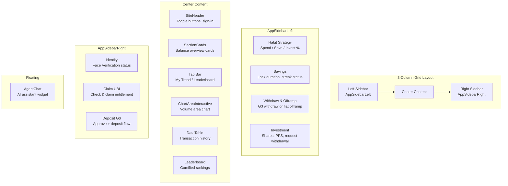

# GoodHabit Frontend

A Next.js 16 dApp that lets GoodDollar UBI recipients manage their savings habit strategy, track streaks, deposit/withdraw G$, offramp to fiat, and monitor their investment yield — all connected to the GoodHabits treasury on Celo.

## Pages

### Landing (`/`)

A full-viewport hero page with a warm animated gradient, floating decorative dots, and a single call-to-action linking to the dashboard.

```tsx
// app/page.tsx — hero section
<div className="relative z-10 flex flex-col items-center justify-center min-h-svh text-center px-4">
  
  <h1 className="text-4xl md:text-6xl font-heading font-bold text-white mb-4">
    Turn your UBI into wealth
  </h1>
  <p className="text-lg text-white/80 max-w-md mb-8">
    Save, invest, and grow your GoodDollar UBI effortlessly.
  </p>
  <Link href="/dashboard">
    <Button className="...">Start your journey</Button>
  </Link>
</div>
```

### Dashboard (`/dashboard`)

The main application with a 3-column grid layout:



## Component Tree

```mermaid
flowchart LR
    L[root layout] --> LP[Landing Page /]
    L --> D[Dashboard /dashboard]
    
    D --> SH[SiteHeader]
    D --> SC[SectionCards]
    SC -->|fetches| API[/api/analytics/user-alloc]
    
    D --> TB[Tab Bar trend/leaderboard]
    TB --> CH[ChartAreaInteractive]
    TB --> DT[DataTable]
    TB --> LB[Leaderboard]
    
    CH -->|fetches| API2[/api/analytics/volume]
    DT -->|fetches| API3[/api/analytics/user-txns]
    LB -->|fetches| API4[/api/analytics/leaderboard]
    
    D --> LSB[AppSidebarLeft]
    LSB -->|fetches| S1[/api/analytics/summary]
    LSB -->|fetches| S2[/api/treasury/users/:addr]
    LSB -->|fetches| S3[/api/offramp/rate]
    LSB -->|writes| S4[POST /api/analytics/habits]
    LSB -->|writes on-chain| TX1[setHabitStrategy]
    LSB -->|writes on-chain| TX2[withdrawSpendable / withdrawSavings]
    LSB -->|writes on-chain| TX3[setTargetSavingsUnlock]
    LSB -->|writes on-chain| TX4[requestWithdrawal]
    
    D --> RSB[AppSidebarRight]
    RSB -->|SDK| ID[Identity SDK<br/>Face Verification]
    RSB -->|SDK| CL[Claim SDK<br/>UBI claiming]
    RSB -->|writes on-chain| TX5[approve + deposit]
    
    D --> AC[AgentChat]
    AC -->|posts| CHAT[/api/agent/chat]
```

## Wallet Connection

Uses [Reown AppKit](https://reown.com/appkit) (formerly WalletConnect) with the Wagmi adapter:

```tsx
// app/config.tsx
const appKit = createAppKit({
  adapters: [wagmiAdapter],
  networks: [celo, fuse, xdc],
  projectId: '81695f4d3284877ad0414039a2f85247',
  features: {
    socials: ['google', 'apple', 'x'],
    email: true,
    emailShowWallets: true,
  },
  themeMode: 'light',
  themeVariables: {
    '--w3m-color-mix-strength': 0,
    '--w3m-accent': '#000000',
  },
})
```

Users can connect via social login, email, or any WalletConnect-compatible wallet. Once connected, the `address` and `chainId` are available via Wagmi's `useAccount()` hook throughout the app.

## Smart Contract Interaction

All treasury contract calls go through custom hooks in `lib/hooks.ts` that wrap Wagmi's `useReadContract`, `useWriteContract`, and `useWaitForTransactionReceipt`:

```typescript
// lib/hooks.ts — example write hook
export function useDeposit(chainId: number) {
  const treasuryAddress = getTreasuryAddress(chainId)
  const { writeContract, data: hash, isPending, isError, error } = useWriteContract()
  const { isLoading: isConfirming, isSuccess: isConfirmed } =
    useWaitForTransactionReceipt({ hash })

  const deposit = (amount: bigint) => {
    writeContract({
      address: treasuryAddress,
      abi: TREASURY_ABI,
      functionName: 'deposit',
      args: [amount],
    })
  }

  return { deposit, hash, isPending, isConfirming, isConfirmed }
}
```

**Contract functions used by the frontend:**

| Function | Hook | Description |
|---|---|---|
| `deposit` | `useDeposit` | Deposit G$ into treasury |
| `withdrawSpendable` / `withdrawSavings` | `useWithdraw` | Withdraw G$ |
| `setHabitStrategy` | `useSetHabitStrategy` | Set Spend/Save/Invest % |
| `setTargetSavingsUnlock` | `useSetTargetSavingsUnlock` | Set savings lock date |
| `requestWithdrawal` | direct | Request share withdrawal |
| `finalizeWithdrawal` | direct | Finalize after cooldown |
| `hasUserSetStrategy` | `useHasUserSetStrategy` | Check if user has a strategy |
| `getUserHabit` | `useGetUserHabit` | Read current strategy |
| `getUserAllocation` | `useGetUserAllocation` | Read bucket balances |
| `targetSavingsUnlock` | `useTargetSavingsUnlock` | Read unlock timestamp |
| `brokeHabits` | `useBrokeHabits` | Read streak break count |
| `approve` | `useApprove` | ERC20 approve G$ for treasury |

## State Management

The app uses **TanStack React Query** for all server and blockchain state, with **React useState** for local UI state.

**Key query keys and their refetch intervals:**

```typescript
// Analytics
queryKey: ['analytics', 'summary']                          // 60s
queryKey: ['analytics', 'volume', timeRange]                // 30s
queryKey: ['analytics', 'leaderboard']                      // 60s
queryKey: ['leaderboard', 'status', address]                // 60s

// User data
queryKey: ['user-alloc', address]                           // 30s
queryKey: ['user-txns', address]                            // 30s
queryKey: ['treasury', 'users', address]                    // 30s

// Offramp
queryKey: ['offramp', 'rate', currency]                     // 60s
queryKey: ['offramp', 'status', requestId]                  // 5s polling
```

After any on-chain mutation, the relevant queries are invalidated:

```typescript
// After a successful deposit
queryClient.invalidateQueries({ queryKey: ['user-alloc', address] })
queryClient.invalidateQueries({ queryKey: ['treasury', 'users', address] })
queryClient.invalidateQueries({ queryKey: ['analytics', 'summary'] })
queryClient.invalidateQueries({ queryKey: ['user-txns', address] })
```

## API Integration

The frontend proxies all `/api/*` requests to the backend via Next.js rewrites:

```typescript
// next.config.ts
async rewrites() {
  return [
    {
      source: '/api/:path*',
      destination: `${process.env.NEXT_PUBLIC_API_URL ?? 'http://localhost:3000'}/api/:path*`,
    },
  ]
}
```

**API endpoints consumed by the frontend:**

| Endpoint | Component | Frequency |
|---|---|---|
| `GET /api/analytics/summary` | AppSidebarLeft | 60s |
| `GET /api/analytics/user-alloc` | SectionCards | 30s |
| `GET /api/analytics/user-txns` | Dashboard page | 30s |
| `GET /api/analytics/volume` | ChartAreaInteractive | 30s |
| `GET /api/analytics/leaderboard` | Leaderboard | 60s |
| `GET /api/analytics/leaderboard/status` | AppSidebarLeft | 60s |
| `POST /api/analytics/habits` | AppSidebarLeft | on save |
| `POST /api/analytics/refresh` | AppSidebarLeft + AppSidebarRight | on mutation |
| `GET /api/treasury/users/:address` | AppSidebarLeft | 30s |
| `GET /api/offramp/rate` | AppSidebarLeft | 60s |
| `GET /api/offramp/beneficiary` | AppSidebarLeft | on offramp |
| `POST /api/offramp/request` | AppSidebarLeft | on offramp |
| `GET /api/offramp/requests/:id` | AppSidebarLeft | 5s polling |
| `POST /api/agent/chat` | AgentChat | on send |

## Agent Chat

A floating chat widget at the bottom-right of the dashboard that communicates with the backend AI agent:

```tsx
// AgentChat dispatches messages to the agent
const res = await fetch('/api/agent/chat', {
  method: 'POST',
  headers: { 'Content-Type': 'application/json' },
  body: JSON.stringify({
    address,
    message: text,
    history: messages.map(m => ({ role: m.role, content: m.content })),
  }),
})
const data: ChatResponse = await res.json()
// data.reply — assistant's text response
// data.suggested_actions — optional action buttons
```

The assistant can answer questions about the user's position, treasury stats, savings strategies, investment mechanics, leaderboard standings, and the offramp pipeline.

## Leaderboard System

A gamified savings competition with 5 tiers:

```typescript
// Scoring formula
points = streakPts + amountPts + consistencyPts

streakPts    = streak * multiplier  // 10, 20, or 30 depending on streak length
amountPts    = Math.min(saved, 10_000)
consistencyPts = consistency * 50  // 0–50
```

| Tier | Points | Visual |
|---|---|---|
| Bronze | 0 | gray |
| Silver | 500 | slate |
| Gold | 2,000 | amber |
| Platinum | 5,000 | cyan |
| Diamond | 10,000 | purple |

Streaks are displayed with flame icons colored by length (7d=orange, 14d=red, 30d+ purple glow). Points can be frozen for 7 days when the user breaks a savings streak.

## Offramp UI

The left sidebar provides a multi-step fiat offramp supporting 17 currencies across Africa, Europe, the Americas, and Asia. The flow:

1. User selects a fiat currency (USD, NGN, KES, EUR, etc.)
2. Enter recipient amount → live G$ equivalent calculated
3. Enter USDC recipient address (on Celo)
4. Click "Offramp" → 3 sequential operations:
   - User signs `withdrawSpendable` tx (on-chain)
   - User signs `approve` tx for backend (on-chain)
   - Backend POST creates offramp request
5. Backend worker processes the swap (G$ → cUSD → USDC)
6. Frontend polls `GET /offramp/requests/:id` every 5s showing live status

```tsx
// Status card after submission shows live progress
{offrampStatus.status === 'completed' ? (
  <span className="text-emerald-600">
    <CheckCircle2 className="size-3.5" /> Swapped & sent
  </span>
) : offrampStatus.status === 'failed' ? (
  <span className="text-rose-600">Failed — contact support</span>
) : (
  <span className="text-amber-600">
    <LoaderCircle className="size-3 animate-spin" /> Processing swap...
  </span>
)}
```

## Setup

```bash
# Install dependencies
npm install

# Copy and fill environment
cp .env.example .env

# Development
npm run dev

# Production build
npm run build
npm run start
```

### Environment Variables

| Variable | Required | Default | Description |
|---|---|---|---|
| `NEXT_PUBLIC_API_URL` | no | `http://localhost:3000` | Backend URL for proxied API calls |
| `NEXT_PUBLIC_TREASURY_CONTRACT` | yes | — | Deployed treasury address on Celo |
| `NEXT_PUBLIC_CELO_MAINNET_RPC_URL` | yes | — | Celo RPC for Infura (fallback for Wagmi) |
